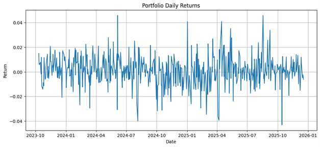
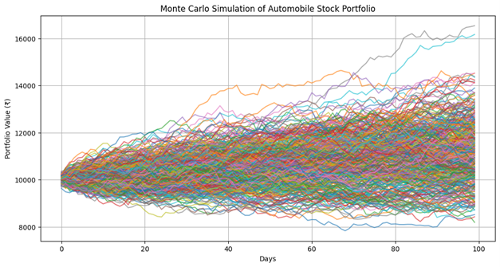
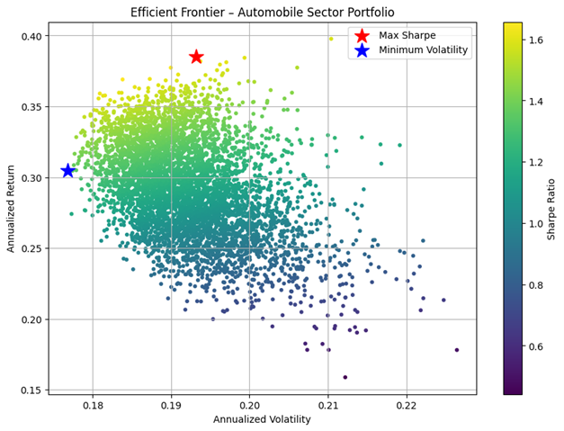

Automobile Portfolio Analysis – Monte Carlo Simulation & Efficient Frontier
This project analyzes a portfolio of 10 Indian automobile and auto-ancillary stocks using advanced portfolio techniques including Monte Carlo simulation, Value at Risk (VaR), CVaR, and Efficient Frontier optimization.

1. Portfolio Universe (NSE Automobile Sector)
The study uses 10 major automobile and auto-ancillary stocks listed on the NSE:
 M&M.NS – Mahindra & Mahindra
 MARUTI.NS – Maruti Suzuki
 BAJAJ-AUTO.NS – Bajaj Auto
 EICHERMOT.NS – Eicher Motors
 TVSMOTOR.NS – TVS Motor
 HEROMOTOCO.NS – Hero MotoCorp
 TATAMOTORS.NS – Tata Motors
 MOTHERSON.NS – Samvardhana Motherson
 ASHOKLEY.NS – Ashok Leyland
 BHARATFORG.NS – Bharat Forge

2. Methodology
 Data Extraction
Historical price data is fetched using `yfinance` for ~800 days to compute:
 Daily returns
 Mean returns
 Covariance matrix
 Portfolio Construction

Random weights (summing to 1) are assigned and used to compute:
 Daily portfolio returns
 Portfolio risk
 Portfolio performance statistics
 Monte Carlo Simulation (400 Runs)

The project simulates future portfolio values over 100 trading days using:
 Cholesky decomposition (to maintain real-world correlations)
 Normally distributed shocks
 Cumulative portfolio value compounding

Outputs include:
 Minimum, Median, Maximum, and Average simulated returns
 Distribution of end values
 Portfolio value trajectory plots
 Risk Metrics

From Monte Carlo results:
 95% Value at Risk (VaR)
 99% Value at Risk (VaR)
 95% Conditional VaR (Expected Shortfall)
 99% Conditional VaR (Expected Shortfall)
These measures quantify downside and tail risk.
 Efficient Frontier & Optimal Portfolios
Using 5000 randomly generated portfolios:
 Annualized return and volatility are computed
 Sharpe ratios are calculated

Two optimal portfolios are identified:
 ⭐ Maximum Sharpe Ratio Portfolio
 🔵 Minimum Variance Portfolio

A complete Efficient Frontier scatterplot is generated with these optimal points highlighted.

3. Technologies Used
Library	Purpose
Python	Analysis & modeling
Pandas	Data manipulation
NumPy	Simulation, matrix algebra
Matplotlib	Visualizations
yfinance	Fetching stock market data
Jupyter Notebook	Interactive analysis

 4. How to Run This Project
 Step 1 — Clone the repository
```bash
git clone https://github.com/ankurbanex1/automobile-portfolio-analysis.git
```
 Step 2 — Install required libraries
```bash
pip install numpy pandas matplotlib yfinance
```
 Step 3 — Open the notebook
```bash
jupyter notebook
```
 Step 4 — Run all cells
The notebook automatically:
 Loads data
 Computes portfolio returns
 Runs Monte Carlo simulations
 Generates VaR & CVaR
 Plots the Efficient Frontier
 Displays optimal portfolios

5. Repository Structure
```
automobile-portfolio-analysis/
│
├── Automobile sector portfolio MCsim.ipynb    Main analysis notebook
├── README.md                              Project documentation
└── (optional) /plots                      Save graphs here
```
6. Learning Outcomes

By completing this project, you understand:

 How to model uncertainty using Monte Carlo simulation
 How to compute portfolio risk & return metrics
 Correlation modeling using Cholesky decomposition
 Value at Risk (VaR) and CVaR
 Efficient Frontier theory and optimization
 How weights impact portfolio volatility and Sharpe ratio

This is a full-stack portfolio analytics workflow.

 7. Author
Ankur Banerjee
MBA (Finance)  Portfolio & Equity Research Enthusiast
Python • Quantitative Finance • Data Analytics

## Portfolio Daily Returns Plot


## Monte Carlo Simulation Plot


## Efficient Frontier


